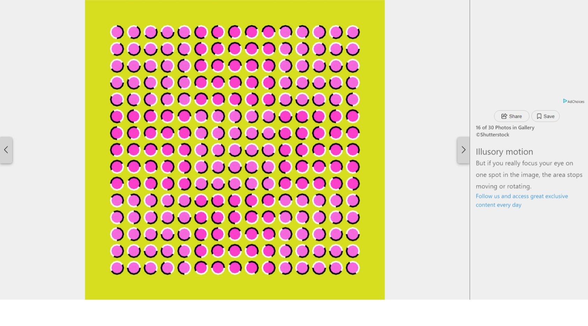

### Optical Illusion 

When I read the article on MSN.com, I saw an Optical Illusion article. I did challenge myself to use JavaScript. 

I used the sample HTML, CSS and JS to complete this project. This project took around 15-20 hours including documentation. 

 

This program allows you to draw automatically in every 2.5 seconds. Press the "Automatic Drawing" and enjoy the show. 

#### Original Picture 

